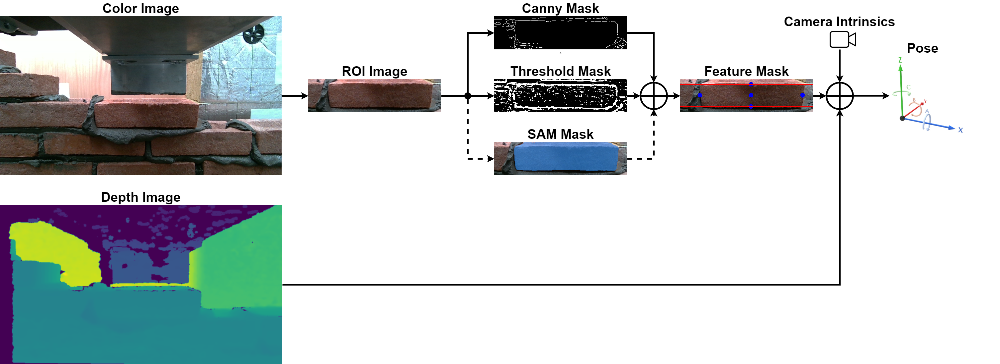
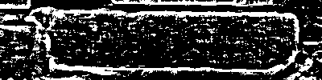
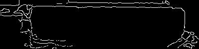
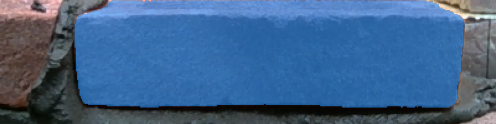
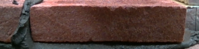
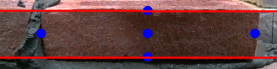
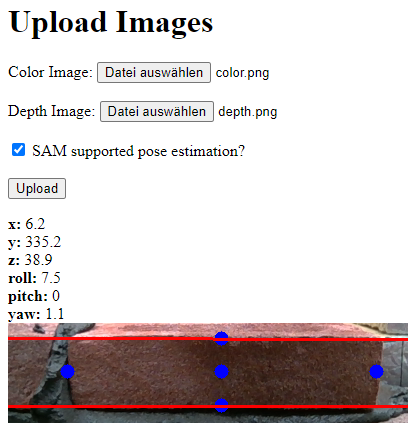

# Brick Pose Estimation
This repository serves as an implementation of a brick pose estimation algorithm based on conventional computer vision and deep learning techniques. The project aims on estimating the 3D pose of a brick placed within a wall relative to the camera's optical center given a color image with its respective depth information. Furthermore, the intrinsic camera parameters as well as the brick dimensions are provided. The algorithm is developed based on a sample dataset consisting of 11 RGB-D images.

**Brick Pose Estimation: 3D pose estimation based on computer vison, deep learning, and depth information**
<div style="text-align:center"></div><br>

## Algorithm
Due to the small size of the sample dataset and missing annotations training a deep learning model from scratch is not feasible. Hence, conventional computer vision methods are applied to solve the task. Additionally, Meta's Segment Anything Model (SAM) is utilized to robustify the segmentation of the brick of interest. Following, the algorithm is described:

<p align="middle">
    
    
    
</p>

<p align="center"> Figure 1: Brick masks as a result of adaptive thresholding (left), canny edge detection (center), and SAM's segmentation (right). </p>

As only parts of the image are of interest and the approximate position of the brick is deterministic, the image is cropped to a region of interest (ROI) in the first step. Subsequently, the brick is segmented resulting in a binary mask of the outline of the front-faced wall. This is achieved by combining adaptive thresholding (see Figure 1, left) and canny edge detection (see Figure 1, center). To robustify the segmentation of the brick of interest Meta's SAM is applied additionaly utilizing a center point prompt (see Figure 1, right). With the help of the masks relevant features are derived: a Hough line transformation is applied to the horizontal edges (see Figure 2, right, red lines) and top, bottom, left, right and center image coordinates of the brick are estimated (see Figure 2, right, blue points). The estimated image coordinates are then transformed to 3D coordinates with respect to the camera center utilizing the intrinsic camera parameters and the depth information. After adding half of the brick depth to the y,-coordinate the center point corresponds to the position (x, y, z) of the brick. The pitch angle is derived from the Hough lines. The roll and yaw angles are calculated based on the camera coordinates of the top, bottom, left and right points of the brick.

<p align="middle">
    
    
</p>

Figure 2: ROI color image of brick of interest without (left) and with estimated features (right). Depicted are the estimated Hough lines and top, bottom, left, right and center image coordinates.

Executing `main.py` initializes a HTTP server which can be accessed by navigating to the local address provided in the console output. Upon uploading the color image with its corresponding depth image, the calculated pose is returned along the image with the resulting estimated features (see Figure 3). In case of an invalid or failed estimation an error message is returned providing further information.

<p align="middle">
    
</p>

<p align="center"> Figure 3: Output of HTTP server. </p>

## Getting started
### Installation

Environments:

- Python 3.8
- PyTorch 2.0.1
- torchvision 0.15.2

Install the package:

```
pip install -r requirements.txt
```

## Demo

- Run `main.py`:

```
python main.py
```

- Open the website via the address provided in the terminal output (usually http://127.0.0.1:5000)

- Upload the color image and the corresponding depth image of a brick from the provided [examples](https://drive.google.com/drive/folders/10DinqEXb_VuZR-B09XTms9QreYOCuIH-?usp=sharing)

- Set the tick `SAM supported pose estimation?` to calculate the pose supported with Meta's Segment Anything Model (SAM)

- Press `Upload` to run the pose estimation
